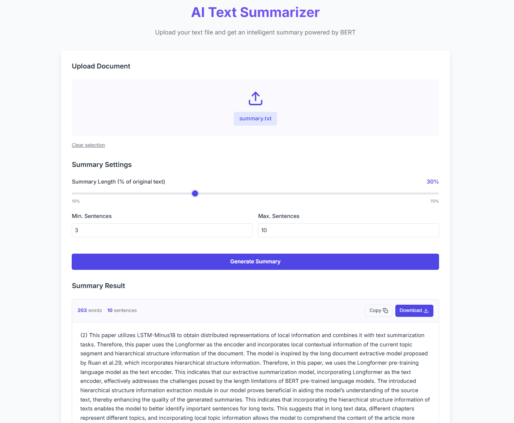

# BERT Extractive Text Summarizer

A modern web application that uses BERT transformers to generate extractive summaries from text documents. This application provides an intuitive interface for uploading text files and customizing summary parameters.

## Features

- **AI-Powered Summarization**: Leverages BERT transformer models for high-quality extractive text summarization
- **Customizable Summary Length**: Adjust the ratio of text to be included in the summary
- **Minimum/Maximum Sentence Control**: Fine-tune your summary with sentence constraints
- **Modern UI**: Clean, responsive interface with drag-and-drop file uploads
- **Instant Results**: View your summary immediately in the browser
- **Download Option**: Save your summaries as text files for later use

## Project Structure

```
.
├── backend/                # Flask API backend
│   ├── app.py              # Main Flask application
│   ├── requirements.txt    # Python dependencies
│   └── uploads/            # Temporary file storage
├── frontend/               # React frontend
│   ├── src/
│   │   ├── App.jsx         # Main React component
│   │   ├── App.css         # Main styles
│   │   ├── index.css       # Global styles
│   │   ├── main.jsx        # Entry point
│   │   ├── assets/         # Static assets
│   │   └── components/     # React components
│   │       ├── FileUpload.jsx
│   │       ├── LoadingSpinner.jsx
│   │       ├── Navbar.jsx
│   │       ├── SummaryControls.jsx
│   │       └── SummaryResult.jsx
│   ├── package.json        # Node.js dependencies
│   └── vite.config.js      # Vite configuration
├── screenshot.png          # Application screenshot
└── summary.txt             # Example summary output
```

## Screenshots

### Application Interface


## Technology Stack

### Backend
- **Flask**: Lightweight Python web framework
- **Transformers**: Hugging Face's transformer models (BERT)
- **PyTorch**: Deep learning framework
- **CORS**: Cross-Origin Resource Sharing support
- **Werkzeug**: WSGI web application library

### Frontend
- **React**: JavaScript library for building user interfaces
- **Vite**: Next generation frontend tooling
- **Modern CSS**: Custom styling with modern CSS features
- **Responsive Design**: Mobile-friendly interface

## Getting Started

### Prerequisites
- Python 3.7+
- Node.js 14+
- npm or yarn

### Backend Setup

1. Navigate to the backend directory:
   ```bash
   cd backend
   ```

2. Create a virtual environment (optional but recommended):
   ```bash
   python -m venv venv
   source venv/bin/activate  # On Windows: venv\Scripts\activate
   ```

3. Install dependencies:
   ```bash
   pip install -r requirements.txt
   ```

4. Run the Flask server:
   ```bash
   python app.py
   ```
   The server will start at `http://localhost:5000`.

### Frontend Setup

1. Navigate to the frontend directory:
   ```bash
   cd frontend
   ```

2. Install dependencies:
   ```bash
   npm install
   # or
   yarn
   ```

3. Start the development server:
   ```bash
   npm run dev
   # or
   yarn dev
   ```
   The application will be available at `http://localhost:5173`.

## Usage

1. Open the application in your web browser
2. Upload a text file using drag-and-drop or the file browser
3. Adjust the summary settings as needed:
   - **Summary Length**: The ratio of the original text to include (10-70%)
   - **Min. Sentences**: Minimum number of sentences to include
   - **Max. Sentences**: Maximum number of sentences to include
4. Click "Generate Summary" to process your document
5. View the generated summary
6. Use the "Copy" button to copy the summary to your clipboard
7. Use the "Download" button to save the summary as a text file

## Model Details

The application uses BERT (Bidirectional Encoder Representations from Transformers), specifically a BERT-based extractive summarization approach inspired by the BERTSUM model. The process works as follows:

1. The document is split into sentences
2. BERT embeddings are generated for each sentence
3. A similarity matrix is built between all sentences
4. The TextRank algorithm ranks sentences by importance
5. Top sentences are selected based on your specified parameters
6. The final summary is presented in original document order

## Future Improvements

- Multiple document format support (.pdf, .docx, etc.)
- Abstractive summarization option
- User accounts for saving summaries
- Batch processing for multiple documents
- Summary comparisons with different parameters
- Language detection and multi-language support

## Contributing

Contributions are welcome! Please feel free to submit a Pull Request.

## License

This project is licensed under the MIT License - see the LICENSE file for details.
